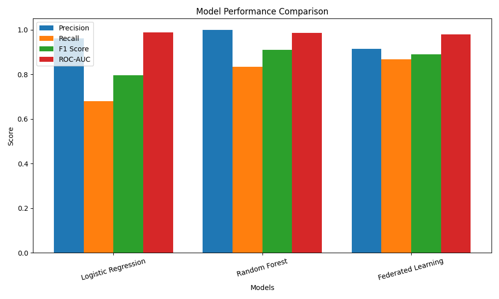

## Privacy-Preserving Spam Detection using Federated Learning
## Overview

This project implements a Spam Detection system for SMS messages using Natural Language Processing and Machine Learning.
The project explores three different training setups:
Traditional ML models (Random Forest, Logistic Regression)
Centralized Neural Network training
Federated Learning training
The main objective is to demonstrate how federated learning can train models collaboratively without sharing raw data, preserving user privacy.

----

## Dataset

Dataset used: SMS Spam Collection Dataset
Total messages: 5574
Classes:
Label	Meaning
0	Ham (legitimate message)
1	Spam
Spam messages are significantly fewer, creating a class imbalance problem.

----

## Project Pipeline

1️. Data Preprocessing

Text messages were cleaned using several NLP steps:
Lowercasing
Removing punctuation
Removing numbers
Removing stopwords
Stemming using Porter Stemmer

Example:
Original:
"Congratulations!!! You won $1000 now!!!"

Cleaned:
"congratul win"

2️. Feature Engineering

Text was converted to numerical vectors using:
TF-IDF Vectorization
TfidfVectorizer(max_features=3000)
This converts text into a 3000-dimensional feature vector representing word importance.

3️. Models Implemented

Traditional Machine Learning Models
Two baseline models were implemented:
Logistic Regression
A linear classification model commonly used for text classification.

Random Forest
An ensemble model that builds multiple decision trees.
Both models were trained on TF-IDF features and evaluated using classification metrics.
Neural Network Model (Centralized Training)
A simple feedforward neural network was implemented using PyTorch.

Architecture:
Input Layer: 3000 features
↓
Linear Layer: 16 neurons
↓
ReLU activation
↓
Output Layer: 1 neuron

Loss function used:
BCEWithLogitsLoss

Class imbalance was handled using:
pos_weight = num_negative / num_positive

Optimizer:
Adam Optimizer
The model was trained for 100 epochs.
Federated Learning Implementation
The neural network was extended to simulate Federated Learning.

----

## Instead of training on centralized data:

1️. Training data was split into 5 clients

num_clients = 5

2️. Each client trains its own local model

3️. Clients send model weights to the server

4️. The server performs Federated Averaging (FedAvg)

avg_weights[key] = torch.stack([w[key] for w in weights]).mean(0)

5️. The averaged weights update the global model

6️. This process repeats for 10 federated rounds

rounds = 10
local_epochs = 10

----

## This simulates real-world systems where:

Data stays on user devices
Only model updates are shared
Evaluation Metrics
Due to class imbalance, accuracy is not reliable.

----

## Instead, the following metrics were used:

Metric:	Purpose
Precision:	How many predicted spam messages are actually spam
Recall:	How many real spam messages were detected
F1 Score: Balance between precision and recall
ROC-AUC: Model discrimination ability
PR-AUC:	Important for imbalanced datasets

----

## Example Results

Example output:

Confusion Matrix:
[[953 12]
 [20 130]]
Metric:	Score
Recall:	0.86
Precision:	0.91
F1 Score:	0.89
ROC-AUC:	0.97
PR-AUC:	0.94

The federated model achieved performance close to centralized training, demonstrating that privacy-preserving training can still maintain strong performance.

----

## Model Comparison

Model	                Precision	    Recall	    F1 Score	    ROC-AUC
Logistic Regression	    0.9623	        0.6800	    0.7969	        0.9874

Random Forest	        1.0000	        0.8333	    0.9091	        0.9860

Federated Learning  	0.9155	        0.8667	    0.8904	        0.9793
(Neural Network)

The following graph compares the performance of Logistic Regression,
Random Forest, and Federated Learning models.

----

## Technologies Used

Python
PyTorch
Scikit-Learn
NLTK
NumPy
Pandas

----

## Future Improvements

Possible extensions:
Differential Privacy
Secure Aggregation
Transformer-based NLP models
Real-time spam detection API
Mobile federated learning simulation

----

## Key Concepts Demonstrated

NLP preprocessing
TF-IDF vectorization
Handling class imbalance
Neural networks with PyTorch
Federated Learning architecture
Privacy-preserving AI systems

----

## License

This project is for educational purposes.

----

## Author

Sahithi Bashetty
bashettysahithi@gmail.com